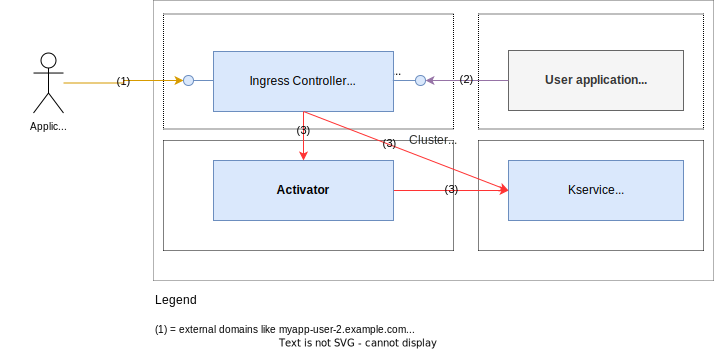
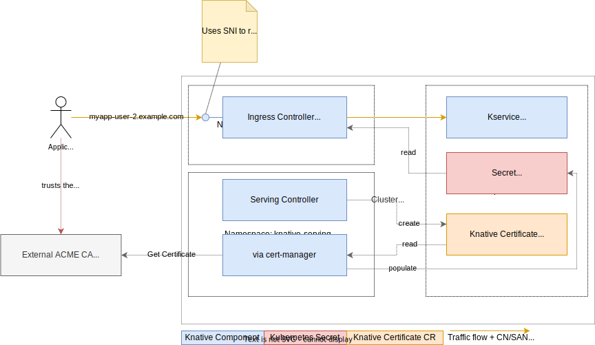
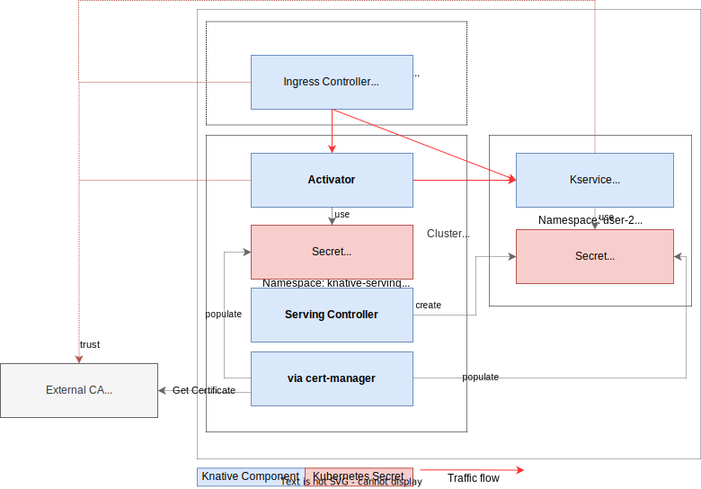

# Serving Encryption Overview

There are three parts to Knative Serving encryption:

1. HTTPS on the ingress layer _external_ to the cluster (cluster external domain, like `myapp-<namespace>.example.com`).
1. HTTPS on the ingress layer _internal_ to the cluster (cluster local domains, like `myapp.<namespace>.svc.cluster.local`).
1. HTTPS between Knative internal components (`ingress-controller`, `activator`, `queue-proxy`).

!!! note
    Currently, all control-plane traffic (including Kubernetes PreStopHooks and metadata like metrics) are not encrypted.

## The parts in detail
The different parts are independent of each other and (can) use different Certificate Authorities to sign the necessary certificates.

### External domain encryption

* Certificate CN/SAN contains the external domain of a Knative Service, e.g. `myapp-<namespace>.example.com`.
* The certificates are hosted using SNI by the external endpoint of the ingress-controller.
* The caller has to trust the (external) CA that signed the certificates (this is out of the scope of Knative).
* These certificates are either [provided manually](TODO) or by enabling [automatic certificate provisioning](TODO)

See [external-domain-tls](TODO) for more information on this feature.

### Cluster-local encryption

* Certificate CN/SAN contains the cluster-local domain of a Knative Service, e.g. `myapp.namespace.svc.cluster.local`, `myapp.namespace.svc`, `myapp.namespace`.
* The certificates are hosted using SNI by the cluster-local endpoint of the ingress-controller.
* The caller has to trust the CA that signed the certificates (this is out of the scope of Knative). One option to do this is using [trust-manager](https://cert-manager.io/docs/trust/trust-manager/) from cert-manager.
* To create the certificates, Knative relies on [cert-manager](https://cert-manager.io/) and our bridging component [net-certmanager](https://github.com/knative-extensions/net-certmanager/). They need to be installed and configured for the feature to work.

See [external-domain-tls](TODO) for more information on this feature.

### Knative system-internal encryption

Knative system internal components (`ingress-controller`, `activator`, `queue-proxy`) are hosting TLS endpoints when this configuration is enabled.

* To get the certificates, Knative relies on [cert-manager](https://cert-manager.io/) and our bridging component [net-certmanager](https://github.com/knative-extensions/net-certmanager/). They need to be installed and configured for the feature to work.
* Specific SANs are used to verify each connection. Each component needs to trust the CA (possibly the full chain) that signed the certificates. For this, Knative system components will consume and trust a provided `CABundle`. The CA bundle needs to be provided by the cluster administrator, possibly using [trust-manager](https://cert-manager.io/docs/trust/trust-manager/) from cert-manager.

See [external-domain-tls](TODO) for more information on this feature.
